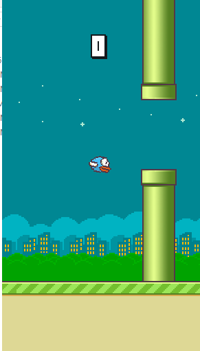

# Flappy Bird

Flappy Bird is an implementation of the famous flappy bird game in pygame. 

<p align='center'>
	
</p>

## Requirements

* Pygame

```bash
pip install pygame
```

## Usage

Navigate and click main.py to open the game, tap anywhere to start the game. The objective of the game is jump and pass through the poles without touching them.

Controls:
* Tap on the screen to make the bird jump.
